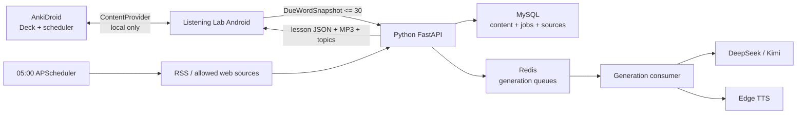

# Listening Lab × Anki 技术设计与开发计划

**状态：** V2.1 MVP 已实现并验证（2026-07-26）

**配套 PRD：** `ANKI_DAILY_LEARNING_PRD.md`

**基线：** Android Kotlin/Compose + Python FastAPI + MySQL + Redis + Edge TTS

## 1. 现状与关键决策

当前 App 通过 Retrofit 使用 `/api/v1/tasks`、`/api/v1/daily-plans/today` 和 `/api/v1/library`。Python 服务已经具备 FastAPI、APScheduler、MySQL 模型、Redis 队列、DeepSeek/Kimi 路由、URL/RSS 内容提取、课程 JSON 校验和 Edge TTS。每日内容当前使用静态话题轮换，默认时间是 05:30。

本设计采用以下决策：

1. **AnkiDroid 是唯一 SRS 事实来源。** Listening Lab 不建立 `review_schedule`，也不写卡片的 due/interval/reps。
2. **手机负责读取 Anki。** 云服务器无法直接访问手机本地 Deck；Android 只上传一次生成所需的有限词汇快照。
3. **Python 是唯一云端业务服务。** 在现有 FastAPI/MySQL/Redis 架构上扩展，不恢复 Java 服务。
4. **新闻必须来源可追溯。** 模型可推荐、排序、摘要和分级改写，但不能把原创文本标为新闻。
5. **05:00 只准备内容。** App 的 WorkManager 负责稍后同步与通知，不触发另一套每日生成。

## 2. 总体架构



信任边界：

- `deckId`、`noteId`、`cardId`、due、interval、reps 只在手机内存中使用。
- 服务端收到 `deckAlias`、词汇正文和不可逆 `clientWordKey`；不收到 AnkiWeb 凭据。
- API Key 沿用现有服务器环境变量或 Android Keystore 配置，不进入请求日志。

## 3. Android 设计

### 3.1 模块

```text
com.example.ttsapp/
├── core/anki/
│   ├── AnkiDroidGateway.kt
│   ├── ContentProviderAnkiGateway.kt
│   ├── AnkiAvailability.kt
│   ├── AnkiPermissionController.kt
│   └── AnkiFieldMapper.kt
├── feature/ankisettings/
├── feature/ankireview/
├── feature/vocabulary/
└── network/AnkiReviewApi.kt
```

核心接口：

```kotlin
interface AnkiDroidGateway {
    suspend fun availability(): AnkiAvailability
    suspend fun listDecks(): List<AnkiDeck>
    suspend fun listNoteTypes(deckId: Long): List<AnkiNoteType>
    suspend fun queryDueWords(binding: AnkiBinding, limit: Int = 30): DueWordResult
    suspend fun findDuplicates(binding: AnkiBinding, words: List<String>): Set<String>
    suspend fun addWords(binding: AnkiBinding, words: List<AnkiWordDraft>): AddWordsResult
}
```

UI/ViewModel 只依赖该接口，便于使用 Fake 实现做本地单元测试。

### 3.2 AnkiDroid 访问

Manifest 增加：

```xml
<uses-permission android:name="com.ichi2.anki.permission.READ_WRITE_DATABASE" />
```

Android 6+ 在运行时请求该权限。实现优先使用 AnkiDroid 官方 API/`FlashCardsContract`：

```kotlin
contentResolver.query(
    FlashCardsContract.Card.CONTENT_URI,
    projection,
    """deck:"${escape(binding.deckName)}" is:due""",
    null,
    null,
)
```

查询 Card 得到 note ID 后，再读取 Note/Model 字段。映射顺序：

1. 用户保存的字段名；
2. 自动识别 `英语单词`、`Word`、`Front`；
3. 释义识别 `中文释义`、`Meaning`、`Back`；
4. 无法唯一识别时返回 `FIELD_MAPPING_REQUIRED`，不猜测写入。

禁止直接打开或修改 `collection.anki2`。官方 API 依赖坐标和当前 AnkiDroid 版本兼容性必须在任务 A0 中实测后固定。

### 3.3 本地配置

使用 DataStore 保存：

```text
anki.enabled
anki.packageName
anki.deckId
anki.deckName
anki.noteTypeId
anki.wordField
anki.meaningField
anki.exampleField
anki.audioField
anki.tags = listening-lab
```

Deck/note type ID 是本地配置，不进入云端。卸载 AnkiDroid、切换集合或 ID 失效时，重新按名称匹配；匹配不唯一则要求用户确认。

### 3.4 快照模型

```json
{
  "clientWordKey": "sha256(installSalt + noteId)",
  "word": "concurrency",
  "meaning": "并发；同时发生",
  "example": "Virtual threads simplify concurrency.",
  "tags": ["java"]
}
```

上传前：

- 去 HTML、脚本和 Anki 模板标记；
- 按 lemma 大小写无关去重；
- 限制 1–30 个词；
- 单字段最大 500 字符；
- 不上传音频二进制、卡片答案历史和排程属性。

### 3.5 Deck 兼容层

“兼容 Deck”不表示后端理解 Anki 模板。Android 将任意 Deck 映射为统一的 `DueWordSnapshot`，后端只处理规范字段：

| 统一字段 | `word --rich` 默认字段 | Basic 回退 | 必填 |
|---|---|---|---|
| `word` | `英语单词` | `Front` | 是 |
| `meaning` | `中文释义` | `Back` | 否 |
| `example` | `英语例句` | 从 `Back` 清洗 | 否 |
| `usageNotes` | `vocabulary扩展` | 空 | 否 |
| `audioRef` | `英语发音` | 任意 `[sound:...]` | 仅本地 |

`word --rich` 的默认笔记类型共有 10 个字段；Android 读取时保留有用文本，但上传只发送生成课程所需的规范字段。后端响应也只使用规范词汇模型，Android 再按用户保存的映射写回目标 Deck。这样新增其他 Deck 模板不需要修改 Python API。

## 4. Python API 契约

所有新增接口放在 `/api/v1`，保持当前 App 契约风格。

### 4.1 创建 Anki 复习课

```http
POST /api/v1/anki/review-lessons
Idempotency-Key: <uuid>
Content-Type: application/json
```

```json
{
  "clientDate": "2026-07-27",
  "timezone": "Asia/Shanghai",
  "deckAlias": "English Vocabulary",
  "level": "B1",
  "voice": "en-US-AvaNeural",
  "topicMode": "DAILY_RECOMMENDED",
  "topicId": "optional-uuid",
  "words": [
    {
      "clientWordKey": "opaque-hash",
      "word": "concurrency",
      "meaning": "并发",
      "example": "..."
    }
  ]
}
```

响应使用异步状态：

```json
{
  "uuid": "lesson-uuid",
  "status": "GENERATING",
  "targetWordCount": 10,
  "coveredWordCount": 0,
  "audioUrl": null,
  "lessonContent": null,
  "failureReason": null
}
```

配套接口：

```text
GET /api/v1/anki/review-lessons/{uuid}
GET /api/v1/anki/review-lessons?clientDate=YYYY-MM-DD
```

幂等键由 `clientDate + normalized words + level + voice + topicId` 计算；同一请求不得重复消耗模型和 TTS。

### 4.2 话题接口

```text
GET  /api/v1/topics/recommendations?date=YYYY-MM-DD&limit=3
POST /api/v1/topics/{uuid}/lessons
GET  /api/v1/daily-plans/today
```

`TopicRecommendation` 必须包含：

```json
{
  "uuid": "topic-uuid",
  "kind": "SOURCE_ARTICLE",
  "category": "TECHNOLOGY",
  "title": "...",
  "summary": "...",
  "sourceName": "...",
  "sourceUrl": "https://...",
  "publishedAt": "...",
  "provider": "deepseek",
  "status": "READY"
}
```

`kind` 仅允许 `SOURCE_ARTICLE` 或 `AI_ORIGINAL`。前者必须有 `sourceUrl`；后者必须无新闻来源标签。

### 4.3 课程 Schema

现有课程 Schema 增加：

```json
{
  "targetWords": ["concurrency"],
  "coveredTargetWords": ["concurrency"],
  "missingTargetWords": [],
  "sourceAttribution": {
    "kind": "SOURCE_ARTICLE",
    "name": "...",
    "url": "...",
    "publishedAt": "..."
  }
}
```

校验器要求 `missingTargetWords` 为空。第一次缺词时执行一次定向修复；第二次仍缺词则任务进入 `FAILED`，错误码为 `TARGET_WORD_COVERAGE_FAILED`。

## 5. MySQL 与 Redis

新增表：

```text
anki_review_lesson
  uuid PK, client_date, deck_alias, level, voice, topic_uuid,
  request_fingerprint UNIQUE, status, lesson_content, audio_url,
  target_word_count, covered_word_count, failure_code,
  failure_reason, created_at, updated_at

anki_review_target
  id PK, lesson_uuid FK, client_word_key, word, meaning, example,
  UNIQUE(lesson_uuid, client_word_key)

topic_candidate
  uuid PK, plan_date, kind, category, title, summary,
  source_name, source_url, published_at, source_hash,
  provider, score, status, failure_reason, created_at,
  UNIQUE(plan_date, source_hash)

daily_generation_run
  id PK, plan_date UNIQUE, status, started_at, completed_at,
  source_count, ready_count, failure_reason
```

这些表只保存生成证据和内容，不保存 Anki 复习计划。

Redis 队列：

```text
queue:python:anki_review
queue:python:topic_ingestion
```

消息只包含 `jobType`、UUID 和 schemaVersion；完整数据从 MySQL 读取。消费成功后更新 MySQL，再 ACK/结束。失败分类为可重试与最终失败，最多 2 次指数退避。

## 6. 05:00 每日流水线

时区固定为 `Asia/Shanghai`，配置默认值改为：

```text
DAILY_PLAN_HOUR=5
DAILY_PLAN_MINUTE=0
```

流程：

1. 获取新闻源白名单中的 RSS/Atom 元数据；
2. 按规范化 URL、标题和正文 hash 去重；
3. 过滤过旧、无来源、内容过短和不可访问项；
4. DeepSeek/Kimi 对候选做类别、学习价值、时效和难度评分；
5. 选择至少 1 个来源文章，并补充 AI 原创候选至 3 个；
6. 生成 B1 学习改写、词汇、题目和 MP3；
7. 校验来源、课程 JSON 和 MP3 可读性；
8. 原子更新当天 `daily_generation_run=READY`。

调度使用 `plan_date` 唯一约束和事务锁防止重复。服务启动时若当地时间已过 05:00 且当天无 READY 结果，执行一次补偿。单源失败只记录该候选，不回滚已经 READY 的内容。

## 7. 安全、版权与可观测性

- 日志不得包含 Anki 字段全文、API Key、Authorization、Redis/MySQL 密码。
- `clientWordKey` 使用安装盐计算，服务端不可反推 note ID。
- 对公网写接口沿用或新增设备 Token；未认证请求返回 401。
- 新闻只保留必要短摘录、规范化 URL、来源和学习改写；付费墙或禁止抓取页面只保存元数据。
- 日志字段：requestId、jobUuid、jobType、provider、model、durationMs、retry、status、failureCode。
- 指标：队列深度、05:00 准备率、目标词覆盖率、Provider/TTS 失败率、新闻源成功率。

## 8. 独立开发与测试任务

| ID | 独立交付物 | 依赖 | 必须运行的测试与验收证据 |
|---|---|---|---|
| A0 | AnkiDroid API 真机兼容性 Spike | 无 | 测试 App 列 Deck、`is:due`、字段、查重和新增；截图 + 结果表；不改生产 UI。 |
| A1 | `AnkiDroidGateway`、安装/权限状态机 | A0 | JVM Fake 单测；真机未安装、拒绝、授权三条 instrumentation 测试。 |
| A2 | Deck 绑定与字段映射 Settings UI | A1 | 映射校验单测；重启后配置恢复；错误 Deck 不允许保存。 |
| A3 | 到期词查询与安全快照 | A1,A2 | `is:due` 数量对比；HTML 清洗、去重、30 词上限、ID 哈希单测。 |
| A4 | 单个/批量加入 Anki 与查重 | A1,A2 | 测试 Deck 执行 5 新 + 2 重复；验证新增数、字段和排程未被修改。 |
| B1 | MySQL 表迁移与 review lesson API | 无 | API 422/401/幂等/查询测试；MySQL 集成测试；迁移可回滚。 |
| B2 | 目标词课程生成、Schema 修复和 Edge TTS | B1 | Mock Provider 单测；缺词修复/最终失败；MP3 头和 HTTP 200。 |
| B3 | Android Anki Review UI 与轮询/播放/答题 | A3,B1,B2 | MockWebServer 测试；Compose 空/加载/失败/READY；取消轮询不泄漏。 |
| N1 | RSS/Atom 来源适配、规范化和去重 | 无 | 固定 fixture 测试；超时、坏 XML、重复 URL、付费墙策略。 |
| N2 | DeepSeek/Kimi 话题评分与来源类型校验 | N1 | Provider A 失败回退 B；`SOURCE_ARTICLE` 缺 URL 必须失败。 |
| N3 | 05:00 幂等调度、启动补偿和话题 API | N1,N2 | 时钟冻结测试；重复触发仅一条 run；单源失败仍有 READY 候选。 |
| N4 | Android Today/Read 话题卡与来源跳转 | N3 | MockWebServer + Compose；来源和 AI 标签正确；原文 Intent 可解析。 |
| E1 | 全链路、日志审计和 APK | A4,B3,N4 | 全量命令、真实云端任务、真机 Anki 对比、MP3 播放、日志脱敏、APK SHA-256。 |

任务 A0、B1、N1 可并行；A0 是所有 Anki 生产代码的冻结闸门。每个任务只修改表中所属模块，测试失败不得进入下一依赖任务。

## 9. 测试策略

### Android

```bash
cd 01tts-app
./gradlew testDebugUnitTest
./gradlew connectedDebugAndroidTest
./gradlew lintDebug assembleDebug
```

- JVM：字段映射、快照清洗、状态机、DTO、Repository。
- MockWebServer：201/200、422、401、429、超时、FAILED。
- 真机：AnkiDroid 安装顺序、权限、目标 Deck、到期搜索、批量写入。

AnkiDroid 真机测试使用专用测试 Deck，不操作正式 Deck；完成后从 AnkiDroid UI 清理测试卡片。

### Python

```bash
cd 01tts-worker
../venv/bin/python -m unittest discover -s tests -v
```

- SQLite 单测保持快速；MySQL/Redis 使用独立集成配置。
- 外部 RSS、DeepSeek、Kimi、Edge TTS 在常规测试中 Mock。
- 阶段验收各执行一次真实来源、真实 Provider 和真实 TTS。

### 合同与端到端

1. Android Fake Anki 返回 10 个 due words；
2. POST review lesson，轮询至 READY；
3. 校验 10/10 目标词覆盖、题目和 MP3；
4. 真机播放并答题；
5. 验证 Anki 排程未变化；
6. 跳转 AnkiDroid 完成一张卡后，刷新只反映 Anki 的新结果。

## 10. 每项完成定义

每个任务同时满足才算完成：

- 实现与错误状态均有测试；
- 新 API 有请求/响应示例和向后兼容说明；
- 不含密钥、真实用户 Deck 导出或生成音频；
- 日志可定位失败但不泄露正文和凭据；
- 对应验收证据保存到测试报告；
- `AGENTS.md` 中规定的模块测试通过。

最终发布额外要求：

- Python 全量测试通过；
- Android unit、instrumentation、lint、assemble 全部通过；
- 05:00 调度在测试时钟与云端各验证一次；
- App 能从真实 AnkiDroid 读取 due words、生成课程、播放 MP3；
- 旧 APK 清理后生成唯一命名 APK，并记录 SHA-256。

## 11. 风险与降级

| 风险 | 降级方案 |
|---|---|
| AnkiDroid API 版本或权限不兼容 | 禁用自动读取，改用 AnkiDroid 分享 Intent/手动选词；不读取数据库文件。 |
| Deck 字段差异大 | 强制手动映射；只读预览通过后才允许写入。 |
| 今日无到期卡 | 提供“最近新增词”或只学习每日新闻，不伪造到期状态。 |
| Provider 返回坏 JSON或缺词 | 校验并修复一次，仍失败则明确 FAILED 并允许重试。 |
| 新闻源不可用 | 使用其他白名单来源；全部失败时生成 `AI_ORIGINAL` 并明确标识。 |
| 05:00 服务离线 | 启动补偿；App 显示最近可用内容和最后同步时间。 |

## 12. 建议实施顺序

```text
A0 兼容性 Spike
  ├─ A1 → A2 → A3 → A4
  ├─ B1 → B2
  └─ N1 → N2 → N3

A3 + B2 → B3
N3 → N4
A4 + B3 + N4 → E1
```

第一可交付切片是 **A0 + A1 + A2 + A3**：只证明“正确绑定并读取今日到期词”。第二切片再接入云端生成，第三切片加入写卡和每日新闻。这样每一步都可独立回退和真机验收。

## 13. 参考资料

- [AnkiDroid 官方仓库与 API 模块](https://github.com/ankidroid/Anki-Android/tree/main/api)
- [AnkiDroid `FlashCardsContract`：Notes、Cards、Decks 与查询契约](https://github.com/ankidroid/Anki-Android/blob/main/api/src/main/java/com/ichi2/anki/FlashCardsContract.kt)
- [AnkiDroid `AddContentApi`：查询、查重和写入接口](https://github.com/ankidroid/Anki-Android/blob/main/api/src/main/java/com/ichi2/anki/api/AddContentApi.kt)
- [Anki 搜索语法](https://docs.ankiweb.net/searching.html)
