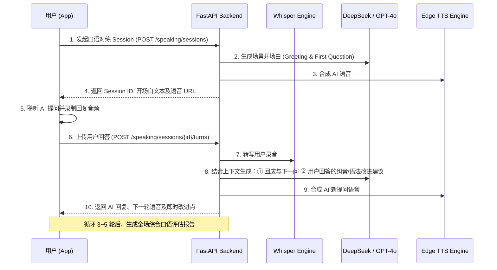

# Listening Lab 全功能增强与架构升级开发文档 (Enhancement Development Plan)

## 1. 文档概述与目标 (Objective & Scope)

### 1.1 升级背景
Listening Lab 当前已完成核心闭环建设（Prompt 课程生成、Edge/OpenAI TTS 神经语音、Whisper 时间戳对齐高亮、单次口语录音打分与 Anki 队列）。
为将产品从“可用的单向学习工具”提升为“高留存、高交互、全场景覆盖的现代化 AI 学习产品”，本计划制定后续功能的详细架构设计、数据契约、接口规范与分阶段落地路线。

### 1.2 核心升级目标
1. **交互形态升级**：从“单次打分”转变为“**多轮场景化角色扮演口语私教**”。
2. **学习效率升级**：提供**全文即点即查词卡**与**原句上下文生词本（FSRS 间隔重复算法）**。
3. **播放场景扩展**：接入系统级 **Media3 后台播放与锁屏控制**，支持通勤、运动等熄屏收听场景。
4. **离线与弱网韧性**：实现 WiFi 下**自动预下载离线包**，无网环境下正常听读与复习。
5. **生成性能突破**：改造 TTS 为**分段并发与流式首句秒开（SSE）**，将生成体感延迟降低 80%。
6. **数据与安全体系**：建立 **JWT 用户账号体系** 与云端多端同步，全面升级 HTTPS 与性能监控。

---

## 2. 核心功能模块设计 (Feature Specifications)

### 模块一：后台播放与系统级媒体控制 (Media3 & Background Playback)

#### 2.1 功能描述
集成 Android `androidx.media3` 与 iOS `AVPlayer / MPNowPlayingInfoCenter`，使音频能够在 App 切入后台或手机锁屏后持续播放，并在系统通知栏、锁屏界面及蓝牙耳机上响应控制指令。

#### 2.2 关键技术实现
* **Android 端**：
  * 创建 `ListeningMediaSessionService : MediaSessionService`，接管 `ExoPlayer`。
  * 构建系统级 `MediaNotification`，包含：当前课节标题、发音人角色、播放/暂停、快进/快退 15 秒、当前句歌词式文本预览。
  * 监听音频焦点（Audio Focus）变化（电话打入自动暂停，电话挂断淡入恢复）。
* **iOS 端**：
  * 配置 `AVAudioSessionCategoryPlayback`，并在 `MPRemoteCommandCenter` 注册播放、暂停、跳转事件。

---

### 模块二：即点即查与上下文智能生词本 (Contextual Dictionary & Smart Vocabulary)

#### 2.1 功能描述
用户在听力播放或阅读文本时，点击任意英文单词即可弹出轻量 BottomSheet 词卡；收藏单词时自动绑定该单词在文章中的**原句上下文**、**音标**与**发音时间戳**，并推入 FSRS 间隔重复复习队列。

```
┌────────────────────────────────────────────────────────┐
│  💡 Word: throughput  /ˈθruːˌpʊt/                       │
│  [n.] 吞吐量；处理能力                                   │
│  ────────────────────────────────────────────────────  │
│  📖 Context Sentence:                                  │
│  "Connection pools improve throughput under load."     │
│  [▶ Play Context Audio]                                │
│                                                        │
│  [ ⭐ Add to Wordbook (Due: Tomorrow) ]                 │
└────────────────────────────────────────────────────────┘
```

#### 2.2 关键技术实现
* **文本分词与跨距点击**：在 Compose 中基于 `ClickableText / AnnotatedString` 或自定义 `Layout` 实现精准单字触摸定位。
* **本地快速查词 + 云端补齐**：本地内置离线常用 10,000 词库（音标 + 简明释义），生僻词或短语搭配异步请求云端 `/api/v1/vocabulary/lookup`。
* **FSRS 算法调度**：弃用简单的固定天数，根据用户评分（Again / Hard / Good / Easy）动态计算遗忘曲线最佳复习间隔。

---

### 模块三：多轮角色扮演 AI 口语私教 (Interactive Role-Play AI Coach)

#### 3.1 功能描述
围绕当前课程主题（如“PostgreSQL 慢查询优化”或“分布式事务选型”），AI 扮演真实场景角色（如“面试官”、“海外同事”、“架构师”），与用户进行 3~5 轮即时问答口语对练。

#### 3.2 对话流转时序



---

### 模块四：流式首句秒开与分段 TTS 管线 (Streaming Chunked Pipeline)

#### 4.1 功能描述
改变以往“整篇生成 ➔ 整篇合成 ➔ 一次性返回”的高延迟模式，改为分段并发渲染。

#### 4.2 架构优化细节
1. **分段切片**：大模型流式输出对话轮次（Turn 1, Turn 2...），后台捕获到完整的 Turn 1 后，立即触发 Turn 1 的 TTS 合成。
2. **首句就绪通知**：Turn 1 合成完成后，通过 **SSE (Server-Sent Events)** 向客户端发送 `READY_FIRST_CHUNK` 事件，客户端在 2 秒内即可开启播放。
3. **无缝拼接**：后台继续并发合成 Turn 2~Turn N 并合并全局时间戳，播放器在播放过程中预缓冲后续音频切片，实现真正的“零等待”流畅体验。

---

### 模块五：WiFi 自动离线下载与缓存引擎 (Offline Cache Engine)

#### 5.1 功能描述
支持将用户每日推荐课程或收藏课程自动下载至本地沙盒，在地铁、飞机等弱网/无网环境下实现全功能离线学习。

#### 5.2 存储架构
```
/data/user/0/com.example.ttsapp/files/offline_lessons/
└── {content_uuid}/
    ├── meta.json         # 课程元数据、选择题与解析
    ├── transcript.json   # 逐词 WordTiming 时间戳与段落
    ├── audio.mp3         # 离线高保真 MP3
    └── speaking_pending/ # 离线录制待同步的答题音频
```

---

### 模块六：统一账号体系与跨端云同步 (Auth & Cloud Sync)

#### 6.1 功能描述
将当前仅限单机的设备 `clientId` 升级为具备认证授权的正式用户账号系统，支持跨手机、平板及多端实时漫游同步。

---

## 3. 共享 API 接口契约定义 (API Specifications)

### 3.1 上下文生词查询与收藏

#### 查词：`POST /api/v1/vocabulary/lookup`
```json
// Request
{
  "word": "throughput",
  "contextSentence": "Connection pools improve throughput under heavy load."
}

// Response (200 OK)
{
  "word": "throughput",
  "phoneticUs": "/ˈθruːˌpʊt/",
  "phoneticUk": "/ˈθruːpʊt/",
  "definitionCn": "吞吐量；处理能力",
  "definitionEn": "The amount of material or items passing through a system or process.",
  "audioUrl": "https://api.example.com/audio/words/throughput.mp3",
  "collocations": ["high throughput", "improve throughput", "system throughput"]
}
```

#### 收藏生词：`POST /api/v1/vocabulary/user-words`
```json
// Request
{
  "word": "throughput",
  "contentUuid": "114f6592-9691-473b-8f26-57f6683b9732",
  "contextSentence": "Connection pools improve throughput under heavy load.",
  "sentenceStartMs": 14200,
  "sentenceEndMs": 18500
}

// Response (201 Created)
{
  "id": 1024,
  "word": "throughput",
  "fsrsState": "NEW",
  "dueTime": "2026-08-19T06:00:00Z",
  "reps": 0
}
```

---

### 3.2 多轮角色扮演口语对练

#### 创建对练 Session：`POST /api/v1/speaking/sessions`
```json
// Request
{
  "contentUuid": "114f6592-9691-473b-8f26-57f6683b9732",
  "scenario": "SYSTEM_DESIGN_INTERVIEW",
  "role": "TECH_LEAD"
}

// Response (201 Created)
{
  "sessionId": "spk-sess-8899aabb",
  "turnIndex": 1,
  "totalTurns": 4,
  "aiPromptText": "Hi there! I noticed you proposed using Redis caching. How would you handle cache breakdown under high concurrency?",
  "aiAudioUrl": "https://api.example.com/audio/speaking/spk-sess-8899aabb-1.mp3",
  "expectedKeyPoints": ["Mutex lock", "Logical expiration", "Bloom filter"]
}
```

#### 提交用户语音轮次：`POST /api/v1/speaking/sessions/{sessionId}/turns`
* **Content-Type**: `multipart/form-data`
* **Form-Fields**:
  * `audio`: `(Binary .m4a / .wav)`
  * `turnIndex`: `1`

```json
// Response (200 OK)
{
  "sessionId": "spk-sess-8899aabb",
  "userTranscript": "We can use mutex lock or logical expiration to prevent cache breakdown.",
  "pronunciationScore": 88,
  "grammarScore": 92,
  "quickFeedback": "Great technical clarity. Notice the pronunciation of 'expiration' /ˌek.spəˈreɪ.ʃən/.",
  "isFinished": false,
  "nextTurn": {
    "turnIndex": 2,
    "aiPromptText": "Good approach. Between mutex lock and logical expiration, which one offers better performance availability?",
    "aiAudioUrl": "https://api.example.com/audio/speaking/spk-sess-8899aabb-2.mp3"
  }
}
```

---

### 3.3 任务流式进度推送 (SSE)

#### `GET /api/v1/tasks/{taskUuid}/events`
* **Accept**: `text/event-stream`
```text
event: stage_change
data: {"stage": "SCRIPT_GENERATING", "progress": 25, "message": "Drafting dialogue turns..."}

event: stage_change
data: {"stage": "TTS_SYNTHESIZING", "progress": 60, "message": "Synthesizing natural voice..."}

event: chunk_ready
data: {"chunkIndex": 0, "audioUrl": "https://api.example.com/audio/chunk-0.mp3", "canPlay": true}

event: completed
data: {"contentUuid": "114f6592-9691-473b-8f26-57f6683b9732", "fullAudioUrl": "https://api.example.com/audio/full.mp3"}
```

---

## 4. 数据库实体与表结构演进 (Database Schema Migration)

```sql
-- 1. 用户与认证表
CREATE TABLE IF NOT EXISTS `users` (
    `id` BIGINT AUTO_INCREMENT PRIMARY KEY,
    `uuid` CHAR(36) NOT NULL UNIQUE,
    `email` VARCHAR(128) UNIQUE,
    `nickname` VARCHAR(64) NOT NULL,
    `avatar_url` VARCHAR(255),
    `cefr_level` VARCHAR(8) DEFAULT 'B1',
    `created_at` TIMESTAMP DEFAULT CURRENT_TIMESTAMP,
    `updated_at` TIMESTAMP DEFAULT CURRENT_TIMESTAMP ON UPDATE CURRENT_TIMESTAMP
) ENGINE=InnoDB DEFAULT CHARSET=utf8mb4;

-- 2. 上下文生词本表 (FSRS 算法模型)
CREATE TABLE IF NOT EXISTS `user_vocabulary_cards` (
    `id` BIGINT AUTO_INCREMENT PRIMARY KEY,
    `user_id` BIGINT NOT NULL,
    `word` VARCHAR(64) NOT NULL,
    `phonetic` VARCHAR(64),
    `definition_cn` VARCHAR(255),
    `context_sentence` TEXT,
    `source_content_uuid` CHAR(36),
    `fsrs_state` VARCHAR(16) DEFAULT 'NEW', -- NEW, LEARNING, REVIEW, RELEARNING
    `stability` FLOAT DEFAULT 0.0,
    `difficulty` FLOAT DEFAULT 0.0,
    `reps` INT DEFAULT 0,
    `lapses` INT DEFAULT 0,
    `due_time` TIMESTAMP NOT NULL,
    `last_review` TIMESTAMP NULL,
    `created_at` TIMESTAMP DEFAULT CURRENT_TIMESTAMP,
    INDEX `idx_user_due` (`user_id`, `due_time`),
    UNIQUE KEY `uk_user_word` (`user_id`, `word`)
) ENGINE=InnoDB DEFAULT CHARSET=utf8mb4;

-- 3. 多轮口语对练 Session 表
CREATE TABLE IF NOT EXISTS `speaking_sessions` (
    `id` BIGINT AUTO_INCREMENT PRIMARY KEY,
    `session_id` VARCHAR(64) NOT NULL UNIQUE,
    `user_id` BIGINT NOT NULL,
    `content_uuid` CHAR(36) NOT NULL,
    `scenario` VARCHAR(64) NOT NULL,
    `status` VARCHAR(16) DEFAULT 'IN_PROGRESS', -- IN_PROGRESS, COMPLETED, ABANDONED
    `total_score` INT DEFAULT NULL,
    `fluency_score` INT DEFAULT NULL,
    `accuracy_score` INT DEFAULT NULL,
    `final_report_json` MEDIUMTEXT DEFAULT NULL,
    `created_at` TIMESTAMP DEFAULT CURRENT_TIMESTAMP,
    `updated_at` TIMESTAMP DEFAULT CURRENT_TIMESTAMP ON UPDATE CURRENT_TIMESTAMP,
    INDEX `idx_user_session` (`user_id`, `status`)
) ENGINE=InnoDB DEFAULT CHARSET=utf8mb4;
```

---

## 5. 迭代规划与里程碑 (Milestones & Sprint Plan)

| 阶段 | 周期 | 核心交付内容 | 验收标志 |
| :--- | :--- | :--- | :--- |
| **Sprint 1 (P0)** | 2 周 | • Android Media3 后台播放与锁屏通知栏<br>• 全文单词点击即查 BottomSheet 词卡<br>• 防抖间隙平滑与高亮动效打磨 | 锁屏状态下可连续收听并切词；在阅读时点击任意单词 100ms 内弹出释义并可一键加入生词本。 |
| **Sprint 2 (P1)** | 3 周 | • 多轮角色扮演 AI 口语私教后端与 App 录音交互<br>• WiFi 自动预下载离线学习包<br>• JWT 账号认证与云端数据漫游 | 用户可在 3~5 轮对话中与 AI 进行技术面试对练；断网模式下仍能完成课程收听与复习。 |
| **Sprint 3 (P2)** | 3 周 | • 分段并发 TTS 与 SSE 流式首句秒开<br>• 音素级发音波形与对比诊断<br>• GitHub/HN/RSS 一键提取播客 | 课程生成首句播放体感延迟降至 2 秒内；口语评分实现音标级纠错与原音回放对比。 |

---

## 6. 自动化测试与质量验收规范 (Testing & Verification)

1. **后端单元与集成测试**：
   - 保持现有 `unittest` 100% 通过：
     ```bash
     cd 01tts-worker && ../venv/bin/python -m unittest discover -s tests -v
     ```
   - 针对新 API (`speaking/sessions`, `vocabulary/lookup`, `SSE stream`) 新增 Mock 单元测试。
2. **Android 自动化测试**：
   - 保证单元测试与构建正常：
     ```bash
     cd 01tts-app && ./gradlew testDebugUnitTest assembleDebug
     ```
   - 真机/模拟器测试 Media3 媒体服务在 Home 键切后台、锁屏状态下的播放回调与耳机线控响应。
3. **性能指标基线**：
   - App 端点词查词响应时间 `< 150ms`。
   - SSE 分段 TTS 模式下首音频块就绪时间 `< 3.0s`。
   - 离线包下载成功率 `> 99%`，离线唤醒加载耗时 `< 300ms`。
