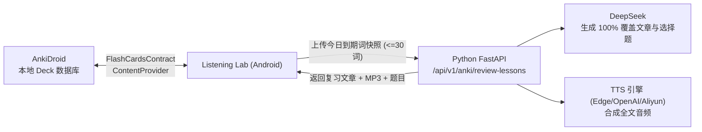

# Listening Lab 产品与技术设计方案

## 1. 文档目标

Listening Lab 从单一的“生成听力音频并答题”工具，扩展为个人使用的英语学习系统。系统围绕每天一套可完成的学习任务，持续训练：

- 单词：发现、收藏、复习和在语境中使用。
- 阅读：新闻、技术文档、长短文理解与总结。
- 听力：全文、逐句、变速和盲听训练。
- 口语：跟读、复述、自由对话和 AI 反馈。
- 写作：摘要、观点表达和句子改写。

产品原则是“同一份内容，多种能力训练”。一篇技术文章可以同时生成生词、阅读题、音频、跟读句子、口语问题和复习卡，避免各功能彼此割裂。

## 2. 目标用户与使用假设

该 App 仅供本人使用，因此允许提供“设备直连 AI Provider”模式：

- 用户在设置页输入自己的 DeepSeek 或 OpenAI API Key。
- Key 不写入源码、Gradle 文件或 APK；使用 Android Keystore 包装后保存在本机。
- 可切换 Provider、模型、超时、温度和每日额度。
- 云端 Spring Boot 与 Python Worker 继续承担内容同步、网页解析、TTS、转写和耗时任务。

设备直连仍需要互联网，但可以通过流式输出避免等待 Redis 任务完成。正式日志不得打印 Authorization Header 或完整 Key。

## 3. 产品信息架构

底部导航采用五个一级入口：

1. **Today**：当天计划、学习进度和继续学习。
2. **Read**：新闻、技术文章、导入 URL/文本和阅读理解。
3. **Practice**：听力、跟读、口语对话和专项训练。
4. **Library**：课程、生词、错题、收藏和已下载内容。
5. **Settings**：Provider、通知时间、难度、兴趣和存储管理。

### 3.1 Today 每日首页

首页只突出一个主行动：“开始今日学习”。默认生成 20–30 分钟计划：

| 环节 | 默认时长 | 完成条件 |
|---|---:|---|
| 单词热身 | 5 分钟 | 复习 8–12 个到期单词 |
| 今日阅读 | 8 分钟 | 阅读文章并完成理解题 |
| 听力重听 | 5 分钟 | 完整播放并完成听力题 |
| 口语复述 | 5 分钟 | 提交一次有效录音并获得反馈 |
| 今日总结 | 2 分钟 | 查看错误和明日复习项 |

卡片显示真实状态：未生成、准备中、可学习、进行中、已完成、失败可重试。首页不使用虚构等级或无依据积分。

### 3.2 Read 阅读中心

内容入口：

- 每日英文新闻：按技术、AI、商业、科学等兴趣拉取。
- 技术文档：Java、Spring、Android、数据库、分布式系统。
- URL 导入：粘贴网页地址，由 Worker 提取正文。
- 文本导入：直接粘贴文档、代码说明或英文段落。
- 难度改写：保留事实，将内容改写为 CEFR A2–C1 难度。

新闻优先使用公开 RSS/Atom、用户主动提供的 URL 或允许 API 访问的数据源。数据库保存来源名称、原始 URL、发布时间和抓取时间；界面始终显示“查看原文”。默认仅缓存个人学习所需正文，不提供转载或公开分发能力。

阅读界面支持：

- 点击单词查看音标、词性、上下文释义和例句。
- 长按句子执行解释、翻译、语法拆解或朗读。
- 原文、简化版、双语辅助三种显示模式。
- 记录阅读位置、阅读时长和查词行为。
- 文末生成主旨题、细节题、推断题、词义题和开放总结题。

### 3.3 Practice 训练中心

训练模式包括：

- **听力模式**：全文播放、隐藏原文、变速、逐句循环。
- **听写模式**：播放一句后输入文本，比较缺词和拼写。
- **跟读模式**：原音与录音 A/B 播放，显示真实振幅。
- **复述模式**：阅读后用英文总结，由 AI 评价信息覆盖度、语法和表达。
- **AI 对话**：围绕文章进行连续问答，流式生成回复。
- **专项训练**：介词、时态、技术表达、面试回答等。

### 3.4 Library 学习资产

- 课程历史：文章、音频、题目、答案和口语成绩。
- 生词本：掌握度、下次复习时间、来源文章和例句。
- 错题本：错误选项、正确答案、AI 解释和再次测试。
- 收藏：文章、句子和 AI 对话。
- 下载：离线文章与音频，可查看占用空间并清理。

## 4. 每日内容与通知流程

### 4.1 用户配置

设置页提供：

- 通知开关与时间，例如每天 08:00。
- 工作日/周末不同学习时长。
- 兴趣标签和技术方向。
- 当前英语等级与目标等级。
- 新闻、技术文档、听力、单词的内容比例。

### 4.2 调度策略

使用 `WorkManager.enqueueUniquePeriodicWork()` 创建唯一的每日任务：

1. 在允许的时间窗口检查当天是否已有计划。
2. 在 Wi-Fi 或任意网络条件下拉取内容，条件由用户选择。
3. 生成 `DailyPlan` 并缓存文章、题目和音频状态。
4. 创建通知：“今日技术英语已准备好：Java Virtual Threads”。
5. 点击通知通过 Deep Link 打开当天计划。

WorkManager 周期任务最小间隔为 15 分钟，实际执行时间受系统省电策略影响，因此产品文案应写“每日约 08:00”，而不是保证精确到分钟。个人学习提醒不需要 `SCHEDULE_EXACT_ALARM`。Android 13 及以上首次开启提醒时请求 `POST_NOTIFICATIONS`。

参考：

- [Android WorkManager 周期任务](https://developer.android.com/develop/background-work/background-tasks/persistent/getting-started/define-work)
- [Android 通知权限](https://developer.android.com/develop/ui/compose/notifications/notification-permission)

## 5. AI Provider 设计

### 5.1 统一接口

Android 新增统一抽象：

```kotlin
interface AiProvider {
    fun streamChat(request: ChatRequest): Flow<ChatChunk>
    suspend fun generateStructured(request: GenerationRequest): LessonContent
    suspend fun testConnection(): ProviderHealth
}
```

实现：

- `DeepSeekProvider`
- `OpenAiProvider`
- `ServerProvider`：通过 Spring Boot 转发，作为兼容和故障回退。

Provider 设置包含 `baseUrl`、`model`、`apiKeyAlias`、`enabled`。DeepSeek 使用 Chat Completions 风格的数据模型；OpenAI 单独实现 Responses API 适配层。业务层只能依赖 `AiProvider`，不能在 UI 中判断厂商。

官方接口参考：

- [DeepSeek API](https://api-docs.deepseek.com/)
- [OpenAI API](https://platform.openai.com/docs/quickstart)

### 5.2 使用分工

| 场景 | 推荐执行位置 | 原因 |
|---|---|---|
| 句子解释、翻译、即时问答 | Android 直连、流式 | 响应快，不需要持久任务 |
| 阅读题与课程结构生成 | Android 直连或 Server | 需要结构化 JSON 和重试 |
| 网页正文提取 | Python Worker | 解析规则、重定向和清洗更稳定 |
| TTS 音频生成 | Python Worker | Edge TTS 和文件上传已可用 |
| 录音转写与口语评分 | Python Worker | 文件处理耗时且依赖模型 |
| 每日计划预生成 | Server + Worker | App 未打开时也能准备内容 |

### 5.3 结构化输出

所有课程生成必须返回固定 JSON，而不是让 UI 解析自然语言：

```json
{
  "title": "Understanding Virtual Threads",
  "level": "B1",
  "sourceType": "TECH_DOC",
  "passage": "...",
  "simplifiedPassage": "...",
  "vocabulary": [
    {
      "word": "concurrency",
      "phonetic": "...",
      "definition": "...",
      "example": "..."
    }
  ],
  "questions": [
    {
      "type": "INFERENCE",
      "prompt": "...",
      "options": ["...", "..."],
      "answer": "...",
      "explanation": "..."
    }
  ],
  "speakingPrompts": ["Summarize the main idea."]
}
```

对 JSON 执行 Schema 校验；失败时最多自动修复一次，仍失败则保留原内容并显示可重试状态。

## 6. 技术架构

```text
Android / Jetpack Compose
├── UI: Today / Read / Practice / Library / Settings
├── ViewModel + UseCase
├── Room: 学习记录、生词、错题、计划、配置
├── DataStore: 非敏感设置
├── Android Keystore: Provider Key 加密密钥
├── WorkManager: 每日同步与通知
├── Media3: 音频播放
├── MediaRecorder: 录音与真实振幅
└── Retrofit/OkHttp
    ├── Direct AI Providers
    └── Spring Boot API

Spring Boot
├── 内容、任务、计划、学习记录 API
├── Redis Publisher
├── 音频文件访问
└── 可选 AI Proxy / Streaming Endpoint

Python Worker
├── 新闻和网页正文提取
├── 课程与题目生成
├── Edge TTS
├── 语音转写
└── 口语评分
```

Android 代码应从当前单文件页面逐步拆分：

```text
com.example.ttsapp/
├── core/ai/
├── core/audio/
├── core/database/
├── core/network/
├── feature/today/
├── feature/reading/
├── feature/listening/
├── feature/speaking/
├── feature/vocabulary/
├── feature/library/
└── feature/settings/
```

## 7. 本地数据模型

Room 建议实体：

- `DailyPlanEntity`：日期、计划状态、预计时长、完成度。
- `ArticleEntity`：标题、来源、正文、简化正文、级别、本地状态。
- `ExerciseEntity`：题型、题干、选项、答案、解释。
- `ExerciseAttemptEntity`：用户答案、是否正确、耗时、提交时间。
- `VocabularyEntity`：单词、释义、音标、例句、掌握度。
- `ReviewScheduleEntity`：下次复习时间、间隔、连续正确次数。
- `SpeakingAttemptEntity`：录音路径、转写、分数、反馈。
- `ListeningProgressEntity`：播放位置、速度、完成状态。
- `ProviderConfigEntity`：Provider、模型、Key 别名，不存明文 Key。

现有 SharedPreferences 历史应迁移到 Room。迁移完成前保留只读兼容入口，确认成功后再删除旧数据。

## 8. 学习算法

### 8.1 单词复习

第一版使用简化间隔重复：

- 新词：当天、1 天、3 天、7 天、14 天。
- 回答正确则进入下一间隔。
- 回答错误则降低一级，并优先使用原文语境重新出题。
- 同一单词至少包含识义、拼写、听音和造句中的两种练习。

### 8.2 自适应难度

根据最近 20 次记录调整：

- 阅读正确率高于 85% 且查词较少：提高文章难度。
- 正确率低于 60%：降低句长和生词比例。
- 听力题正确但复述差：增加口语总结而不是继续增加选择题。
- 经常错误的语法点进入专项训练。

所有推荐需显示原因，例如“你最近在推断题上错误较多”，避免不可解释的自动调整。

## 9. 页面与视觉规范

- 品牌固定为 **Listening Lab**。
- 背景使用石墨黑 `#0D1110`，主强调色使用翡翠绿 `#55B88A`。
- 每个页面只保留一个主要操作。
- 训练结果使用真实数据，不使用虚构 XP、排名或连续天数。
- 阅读正文优先保证行高、字号和段落留白；工具按钮在选择文字后出现。
- 所有异步页面必须包含 skeleton、空状态、失败原因和重试。
- 音频、下载、AI 生成分别显示独立状态，避免一个全局 Loading 遮住整个页面。
- 重要操作具备按压反馈；自动动画不得代替真实录音、下载或处理进度。

## 10. 分阶段开发路线

### Phase 1：学习基础设施

- [ ] 引入 Room，迁移课程历史、口语成绩和听力成绩。
- [ ] 拆分 Navigation 与五个一级页面。
- [ ] 建立统一 `AiProvider` 和设置页。
- [ ] 完成 DeepSeek/OpenAI 连接测试与流式聊天。
- [ ] 增加 API 调用超时、取消、错误分类和用量记录。

验收：切换任意 Provider 后可流式解释一句英文；重启 App 后配置与记录保留。

### Phase 2：阅读与单词闭环

- [ ] URL/文本导入。
- [ ] 阅读器、查词、句子解释和难度改写。
- [ ] 五类阅读理解题与错题解释。
- [ ] 生词本与间隔复习。

验收：完成一篇技术文章后产生阅读成绩、生词和错题；第二天可继续复习。

### Phase 3：每日计划与通知

- [ ] Today 首页与计划生成。
- [ ] WorkManager 周期任务。
- [ ] 通知权限、通知渠道和 Deep Link。
- [ ] 新闻/技术文档兴趣配置。
- [ ] 失败补偿与手动“重新生成今日内容”。

验收：App 关闭后仍能在设置的时间窗口收到通知，点击直达当天文章。

### Phase 4：听力与逐句跟读

- [ ] 文章自动生成音频。
- [ ] 句子时间轴、逐句循环和听写。
- [ ] 原音/录音对比。
- [ ] 文章级听力题和复述。

验收：同一篇文章可以完整完成阅读、听力、听写和复述。

### Phase 5：AI 口语教练

- [ ] 连续多轮对话。
- [ ] 流式文字与分段 TTS。
- [ ] 会话结束报告。
- [ ] 常见错误进入专项训练。

验收：完成至少五轮上下文连续的英语对话，并生成可保存的复盘报告。

### Phase 6：离线与质量提升

- [ ] 文章、音频和复习卡离线下载。
- [ ] 可选端侧摘要或改写。
- [ ] 数据导出与备份。
- [ ] 性能、无障碍和电量消耗测试。

## 11. 测试与质量门槛

### Android

- ViewModel、Room Migration、Provider Adapter 和复习算法单元测试。
- MockWebServer 验证流式响应、401、429、超时和 JSON 损坏。
- Compose UI 测试覆盖 Today、阅读答题、查词、录音和历史恢复。
- WorkManager 测试覆盖唯一任务、失败重试和通知 Deep Link。
- 每个阶段执行：

`clean` 与 Lint/打包拆成两次 Gradle 调用，避免清理任务和报告任务在同一任务图中争用构建产物：

```bash
./gradlew clean testDebugUnitTest assembleDebug
./gradlew lintDebug
```

### Server

- Controller、Service、数据库和 Redis 集成测试。
- Provider Proxy 不记录 API Key。
- 内容生成必须校验 JSON Schema。

```bash
mvn clean test
```

### Worker

- 网页正文提取、AI 返回解析、TTS、转写和评分分别测试。
- 外部服务在普通测试中使用 Mock。

```bash
../venv/bin/python -m unittest discover -s tests -v
```

### 端到端验收

1. 定时任务生成今日技术文章。
2. 通知打开 Today 页面。
3. 阅读并收藏两个生词。
4. 完成阅读理解并保存错题。
5. 播放文章音频并完成听力题。
6. 录制英文复述并得到转写、评分与反馈。
7. 重启 App，以上数据仍可从 Library 恢复。

## 12. 首个实施迭代

建议下一次开发只完成以下垂直切片：

1. Room 数据库与现有历史迁移。
2. Today、Read、Library 三个导航页面。
3. Provider 设置页和 DeepSeek/OpenAI 连接测试。
4. 粘贴英文文本后直接生成阅读课程。
5. 保存生词、完成三道阅读题并写入历史。

该切片完成后，系统已经从听力工具升级为可每天使用的阅读与词汇产品；之后再接入新闻定时任务、逐句听力和实时口语，风险更低。

---

## 13. AnkiDroid 词汇联动与每日复习系统设计

### 13.1 核心原则与信任边界

1. **AnkiDroid 是唯一 SRS 事实来源**：Listening Lab 不自建独立的“艾宾浩斯”排程，也不修改 Anki 卡片的 `due`、`interval`、`reps` 等排程字段；学习完成后由用户主动前往 AnkiDroid 进行评分与卡片到期推进。
2. **数据隐私与安全**：云服务器仅接收生成课程所需的词汇快照（最多 30 词），不接收完整 Deck、AnkiWeb 凭据或卡片历史记录。
3. **明确反馈与原子查重**：单词从阅读界面批量/单个写入 Anki 时，本地自动去重；写入失败与重复项明确分类提示，不回滚已成功写入的卡片。

### 13.2 核心流程



1. **Deck 绑定**：进入 `Settings → Anki`，请求 `com.ichi2.anki.permission.READ_WRITE_DATABASE` 权限，选择目标 Deck 并完成字段映射。
2. **今日到期词复习课**：查询 `deck:"..." is:due` 获取今日到期词，提交至云端生成 250–500 词连贯短文（目标词高亮）、全文语音与理解题。云端必须校验目标词 100% 覆盖率，缺失时自动修复。
3. **新词加入 Anki**：阅读文章时点击生词或批量勾选，直接调用 AnkiDroid Gateway 写入目标 Deck，自动识别标准字段（`英语单词`、`英美音标`、`中文释义`、`英语例句` 等）。

### 13.3 关键接口契约

- `POST /api/v1/anki/review-lessons`：提交当日到期词快照并异步排队生成复习文章。
- `GET /api/v1/anki/review-lessons/{lesson_uuid}`：轮询获取生成的复习课正文、高亮词汇、MP3 地址与选择题。
- `GET /api/v1/anki/review-lessons?clientDate=YYYY-MM-DD`：按客户端日期查询当天的复习课历史。
